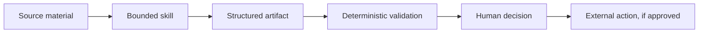

# Agent Ops Skills

[](https://github.com/KyleBrierley/agent-ops-skills/actions/workflows/validate.yml)

Reusable skills for evidence-backed research, approval-gated operations, structured
records, and durable agent handoffs.

These packages extract the operating patterns behind real agent-assisted products
without publishing their private prompts, source code, credentials, or user data.

## Skills

| Skill | Use it when | Produces |
| --- | --- | --- |
| [`evidence-backed-research`](skills/evidence-backed-research/SKILL.md) | Claims need traceable sources and honest confidence labels | A structured evidence packet with conflicts and gaps |
| [`human-approved-publishing`](skills/human-approved-publishing/SKILL.md) | An agent may prepare content but a person must authorize publication | A reviewed draft and explicit publication decision |
| [`schema-validated-records`](skills/schema-validated-records/SKILL.md) | Research must become machine-readable without losing provenance | A schema-valid record plus validation report |
| [`context-packet-builder`](skills/context-packet-builder/SKILL.md) | A fresh agent needs the smallest useful view of file-backed state | A compact, prioritized handoff packet |

## Operating model



The common design principle is simple: agents may gather, transform, check, and
recommend. External actions remain visible and approval-gated.

## Install

Copy a skill directory into the skill location used by your agent environment, or point
your agent at its `SKILL.md`. Each skill is self-contained and links only to files inside
its own directory.

The instruction format is compatible with the common `SKILL.md` convention. The included
scripts are tested with Python 3.11+.

## Validate

```bash
python3 scripts/validate_skills.py
python3 -m unittest discover -s tests
python3 skills/context-packet-builder/scripts/build_context_packet.py \
  --input skills/context-packet-builder/examples/input/project-state.json \
  --output /tmp/context-packet.md
```

CI runs the same checks on every pull request.

## Executable example

The [ticket approval example](examples/action-approval/README.md) checks whether a
proposed change has approval for its exact contents before writing to a synthetic
ticket. It includes version checks, replay handling, an audit trail, and tests for
rejected actions and interrupted execution. Run it locally with:

```bash
python3 examples/action-approval/demo.py
```

The demo uses scripted approval and a local SQLite database. It makes no model calls.

## Design boundaries

- Synthetic examples only.
- No private URLs, personal identifiers, customer records, or environment-specific paths.
- No claim that a model verified something unless a deterministic check or human review did.
- No external send, submit, merge, or publish action without an explicit approval step.
- Small core instructions; supporting examples live beside the skill.

## Origin

These skills are sanitized extractions from patterns used in TheTechStack and a
file-backed agent operations system. The implementations here are standalone public
artifacts, not copies of either private system.

## License

[MIT](LICENSE)
