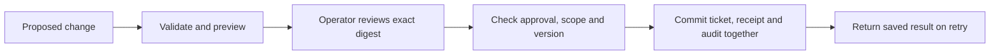

# Approve an exact ticket change

An agent proposes changing a support ticket from open to pending. Someone reviews
it. Before the change runs, the proposal changes or another person updates the ticket.
Should the original approval still count?

This example binds approval to the exact proposal and checks the ticket version
again at execution. Everything runs against a temporary SQLite database with one
synthetic ticket. There are no model calls or external writes.

## Run it

From the repository root, with Python 3.11 or later:

```bash
python3 examples/action-approval/demo.py
python3 -m unittest discover -s tests -p 'test_action_approval.py' -v
```

The demo prints a preview, a rejection before approval, one successful change, and
a repeated request that returns the saved result. The ticket ends at version 2.
`expected-trace.json` contains the reproducible output. The demo scripts the operator
approval so anyone can reproduce it; it does not claim a person reviewed each run.

## How it works



- `executor.py` validates proposals, records reviews, and executes changes.
- `demo.py` runs the synthetic scenario and prints its audit trail.
- `../../tests/test_action_approval.py` checks failure behavior and recovery.

A proposal contains exactly five fields:

```json
{
  "request_id": "request-1",
  "ticket_id": "DEMO-1",
  "expected_version": 1,
  "operation": "set_status",
  "status": "pending"
}
```

The operator calls `preview`, inspects the before/after values, and passes the
displayed digest to `review`. The executor hashes all five fields. Changing any
field requires a new approval. The proposer cannot authorize itself by adding an
`approved` field; unknown fields fail validation.

Only `set_status` is allowed, with a status of open, pending, or resolved. The
operator supplies the ticket allowlist separately. Ticket text is stored as data
and never interpreted as executor instructions.

SQLite serializes writes. The ticket update, execution receipt, and success audit
entry share one transaction. A retry with the same request ID and digest returns
the original receipt, even after reopening the database. Reusing that ID for a
different action fails. A replay describes the original result, which may differ
from the ticket's current state after later changes.

## Failure and recovery

| Condition | Result | Next step |
| --- | --- | --- |
| Missing, declined, or revoked approval | No ticket write | Review the exact proposal |
| Proposal changed after review | No ticket write | Preview and approve the new proposal |
| Ticket version changed | No ticket write | Refresh the ticket and request a new review |
| Duplicate execution | Saved receipt; no second change | Inspect the receipt |
| Request ID reused for different content | Rejected | Use a new ID and obtain approval |
| Invalid fields, operation, or target | Rejected | Correct the proposal within permitted scope |
| Simulated exception after write, before receipt | Transaction rolled back | Reopen the database and retry |

## Design choices and limits

SQLite keeps the write and receipt together without adding a service. Hashing a
canonical proposal makes the approval check easy to inspect. It does not prove
who approved it. Version checks prevent overwriting a ticket that changed after
review, including changes that happen to leave its status the same.

This is a trusted-local-operator example. Anyone who can edit the database or call
`review` can grant approval. A real deployment needs an authenticated review service,
permission checks, approval expiry, and protected audit storage. Do not expose
`review` as an agent tool. Reviews do not expire here.

Tests cover a simulated exception and restart, not power loss, operating-system
crashes, or distributed execution. SQLite transactions cannot make an external API
call atomic with this database. Failed-attempt logging is a separate transaction
and can be lost if the process dies between rollback and logging. Concurrent worker
stress testing is outside this example.

The hostile sentence in the fixture checks that ticket text cannot change this
executor's policy. There is no model here, so this is not a prompt-injection
benchmark or evidence of model accuracy.

This example was implemented with AI assistance. The accompanying tests and trace
show the behavior checked so far. A hands-on walkthrough and review are still needed
before using it as evidence of personal implementation fluency.
